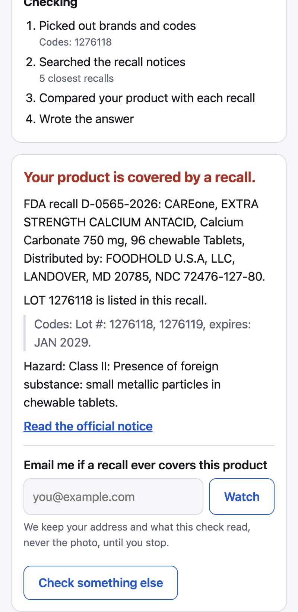
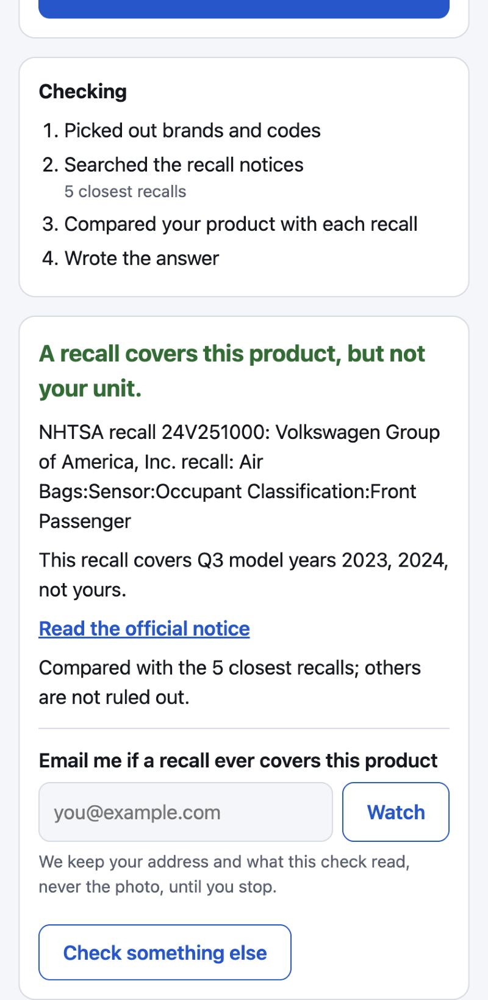
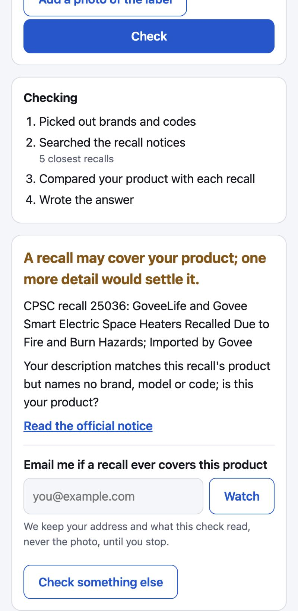
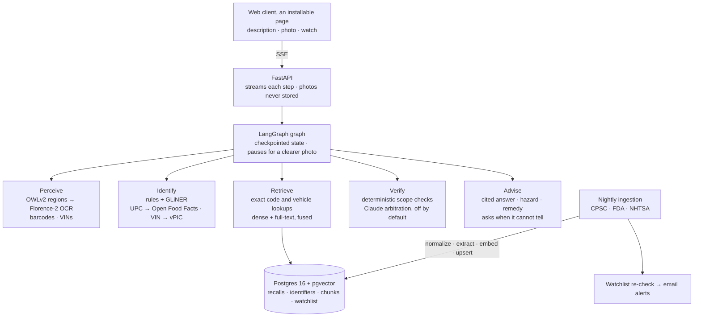

# RecallLens

[](https://github.com/coder-raj369/recall-lens/actions/workflows/ci.yml)

**Point a camera at a product, car, food or medicine and find out whether it has been recalled, with evidence.**

<p align="center">
  
  
  
</p>

RecallLens is a multimodal, multi-agent system that identifies a product from a photo or a typed description, extracts the identifiers that actually determine recall status (UPC, model number, lot code, best-by date, VIN), searches recalls from CPSC, FDA and NHTSA, verifies whether *this specific unit* falls inside the recalled range, and explains the hazard and remedy with citations. When it cannot be sure, it says so.

> **Status:** all six phases are built (foundations; ingestion and corpus; retrieval; perception; multi-agent orchestration; evaluation and LLMOps; product). Two things remain before Phase 6 closes: a demo recording, and a run of the email alerts against a real mail server. There is no hosted deployment ([ADR-0008](docs/adr/0008-static-client-and-one-command-container.md)): the whole system runs with one command. See [ROADMAP.md](ROADMAP.md) for the delivery plan and the [write-up](docs/writeup.md) for what the measurements showed.

---

## The problem

US recall data is fragmented across four agencies, each with its own API, schema and vocabulary:

| Agency | Covers | Source |
|---|---|---|
| CPSC | Consumer products (toys, appliances, furniture) | [SaferProducts.gov Recalls API](https://www.saferproducts.gov/) |
| FDA | Food, drugs, medical devices | [openFDA enforcement reports](https://open.fda.gov/apis/) |
| USDA FSIS | Meat, poultry, egg products | [FSIS Recall API](https://www.fsis.usda.gov/): *deferred, API blocks automated clients ([ADR-0004](docs/adr/0004-defer-fsis-ingestion.md))* |
| NHTSA | Vehicles, tires, car seats | [NHTSA Recalls API and datasets](https://www.nhtsa.gov/nhtsa-datasets-and-apis) |

Whether a recall applies to you usually depends on a detail printed on the product, such as a lot code, a production date window or a model suffix, not on the product name. Keyword search and plain semantic search both fail here: *"is lot 2231 inside 2201–2245?"* is a structured question, not a similarity question.

RecallLens treats it as one. Perception reads the label, extraction turns it into typed identifiers, retrieval finds candidate recalls, and a verifier applies deterministic range checks before any language model is asked for judgment.

## How it works



1. **Perceive.** A zero-shot detector locates the label, barcode and rating-plate regions; Florence-2 reads the whole photo and each region, and barcodes and VINs are decoded directly.
2. **Identify.** Rule-based parsers and a zero-shot NER model produce typed identifiers. Barcodes resolve through Open Food Facts; VINs decode through NHTSA vPIC.
3. **Retrieve.** Exact matches come first: codes against stored identifiers, and a named make, model and model year against each recall's vehicle list. Hybrid retrieval (vector + IDF-weighted full-text, fused) fills the rest; a cross-encoder reranker is available and off by default.
4. **Verify.** Lot, date, model and vehicle scopes are checked in code. Claude arbitration of what the rules cannot decide is built and off by default, because every call is billed.
5. **Advise.** Answers cite the recall notice and quote it. When the rules cannot settle it, the system asks for the missing detail or a clearer photo instead of guessing.

## Design principles

- **A false "safe" is the worst possible answer.** The primary evaluation metric is the false-negative rate, and abstention is a first-class outcome.
- **Rules before models.** Anything that can be checked deterministically is checked deterministically.
- **Every claim is measured.** Each phase ships with a gold dataset, metrics and ablations; the results table below is filled in only with measured numbers.
- **One data store until proven otherwise.** Postgres holds relational data, full-text indexes and vectors ([ADR-0001](docs/adr/0001-postgres-pgvector.md)).

## Hugging Face tasks

| Task | Model | Role | Status |
|---|---|---|---|
| Zero-Shot Object Detection | OWLv2 | Locate label, barcode and rating-plate regions | In use (Phase 3) |
| Image-to-Text | Florence-2-large | Read label text (OCR) from photos and regions | In use (Phase 3) |
| Token Classification | GLiNER | Extract brands from recall and label text | In use (Phases 1, 3) |
| Sentence Similarity / Feature Extraction | bge-m3 | Dense embeddings | In use (Phase 1) |
| Text Ranking | bge-reranker-v2-m3 | Cross-encoder reranking (opt-in) | In use (Phase 2) |
| Text Generation | Claude Opus 5.5 | Arbitrates matches the rules cannot decide; single-agent baseline | Built, off by default (billed per call) |

Considered and not built: receipt parsing (Document Question Answering), visual search with SigLIP for photos without legible text (Image Feature Extraction), and voice queries (Automatic Speech Recognition).

## Tech stack

| Layer | Choice |
|---|---|
| Language and tooling | Python 3.12, uv, Ruff, pytest |
| Orchestration | LangGraph ([ADR-0002](docs/adr/0002-langgraph-orchestration.md)) |
| Data | PostgreSQL 16 + pgvector |
| Ingestion | Scheduled GitHub Actions workflow ([ADR-0005](docs/adr/0005-scheduled-ingestion-github-actions.md)) |
| Serving | FastAPI (SSE); local open models on CPU/Apple GPU ([ADR-0006](docs/adr/0006-local-open-vision-models.md)) |
| Frontend | A static, installable web page served by the API: no framework and no build step |
| Evaluation | Custom harnesses per stage; replay gate in CI ([ADR-0007](docs/adr/0007-evaluate-and-observe-without-paid-llm-calls.md)) |
| Observability | OpenTelemetry spans per graph step, locally or to any OTLP backend such as Langfuse |
| Delivery | GitHub Actions (tests, evaluation gate, container build); Docker Compose runs the whole system ([ADR-0008](docs/adr/0008-static-client-and-one-command-container.md)) |

## Evaluation

Evaluation is built alongside each capability, not after it.

| Stage | Dataset | Metrics |
|---|---|---|
| Identifier extraction | 160 hand-labeled recalls (100 dev, 60 held-out test) | Field-level precision, recall, F1 |
| Retrieval | 150 known-item queries (50 dev, 100 held-out test) | Recall@k, MRR; ablation from dense to hybrid + identifiers + rerank |
| Perception | 150 labeled public photos (50 dev, 100 held-out test) | Field P/R/F1; whole photo vs + regions; photo-to-recall Recall@k |
| End to end | 300 cases (48 dev, 102 test, 150 fresh holdout) incl. hard negatives (same product, unlisted lot) | **False-negative rate**, unsafe answers, false alarms, abstention rate, citation accuracy |
| Operations | Load test of the running API; Claude cost estimated from the prompts it would receive | Checks per second, p50/p95 latency per step, cost per check |

Answers are built from templates, the cited notice and quotes verified to occur in it, so citations are checked in code; an LLM judge waits for an LLM budget ([ADR-0007](docs/adr/0007-evaluate-and-observe-without-paid-llm-calls.md)). CI replays verification on all 300 recorded cases and blocks any change that adds a missed recall or an unsafe answer.

### Results

Populated as phases complete. No numbers are reported before they are measured.

#### Phase 1: corpus and identifier extraction

**Corpus.** A backfill of everything published from 2024-01-01 to 2026-09-25, run on an Apple-silicon laptop:

| Agency | Recalls | Breakdown | Sync time* |
|---|---|---|---|
| CPSC | 1,184 | consumer products | 10.4 min |
| FDA | 14,420 | 8,410 devices · 3,985 food · 2,025 drugs | 90.6 min |
| NHTSA | 2,724 | 2,425 vehicles · 246 equipment · 37 tires · 16 child seats | 6.9 min |
| **Total** | **18,328** | 26,537 embedded chunks (1.45 per recall) | ~1.5 h embedding |

\*Fetch, extraction (including GLiNER) and upsert. An immediate re-run of a 4,785-recall sync reported every recall unchanged, and the nightly workflow verifies all three connectors against the live APIs. USDA FSIS is deferred ([ADR-0004](docs/adr/0004-defer-fsis-ingestion.md)).

**Identifier extraction**, held-out test split (60 recalls, 289 gold identifiers). Codes must match exactly, and brands match leniently ([guidelines](evals/datasets/README.md)):

| Kind | Rules only | GLiNER only | Rules + GLiNER (all kinds) | **Production**: rules for codes, GLiNER for brands |
|---|---|---|---|---|
| Brand | — | 0.74 / 0.81 / 0.78 | 0.74 / 0.81 / 0.78 | **0.74 / 0.81 / 0.77** |
| Model | 0.95 / 0.28 / 0.43 | 0.46 / 0.37 / 0.41 | 0.51 / 0.46 / 0.49 | **0.95 / 0.28 / 0.43** |
| Lot / serial | 0.92 / 0.75 / 0.82 | 0.57 / 0.16 / 0.25 | 0.81 / 0.79 / 0.80 | **0.92 / 0.75 / 0.82** |
| UPC / GTIN | 1.00 / 0.50 / 0.67 | 0.64 / 0.35 / 0.45 | 0.74 / 0.54 / 0.62 | **1.00 / 0.50 / 0.67** |
| NDC | 1.00 / 1.00 / 1.00 | — | 1.00 / 1.00 / 1.00 | **1.00 / 1.00 / 1.00** |
| **All (micro)** | 0.94 / 0.41 / 0.57 | 0.62 / 0.40 / 0.49 | 0.72 / 0.70 / 0.71 | **0.86 / 0.63 / 0.73** |

Values are precision / recall / F1, for the current rules: Phase 6 stopped reading sizes such as "5-in-1" as model numbers, which raised model precision from 0.91 to 0.95. The production configuration was chosen on the dev split, where letting GLiNER add codes lowered code F1 from 0.59 to 0.55. Keeping codes rule-based holds their precision at 0.94 by design: a wrong lot or model number is worse than a missing one, because the verifier can ask for a clearer photo when a code is missing but cannot detect a confidently wrong one. The main gaps are unlabeled model names and bare UPC digits, which Phase 3's label reading targets.

#### Phase 2: retrieval

Held-out test split: 100 known-item queries over the 18,328-recall corpus ([how the set was built](evals/datasets/README.md#retrieval)). Each row adds one stage. Recall@k is the share of queries with the target recall in the top k; latency is per query on an 8 GB Apple-silicon laptop, excluding query embedding.

| Configuration | Strict R@1 | Strict R@5 | Strict MRR@10 | Lenient R@5 | p50 | p95 |
|---|---|---|---|---|---|---|
| Dense (bge-m3, HNSW) | 0.63 | 0.82 | 0.72 | 0.87 | 94 ms | 323 ms |
| Full-text, IDF-weighted | 0.83 | 0.97 | 0.88 | 0.99 | 4 ms | 11 ms |
| Hybrid (RRF of both) | 0.70 | 0.92 | 0.80 | 0.97 | 29 ms | 72 ms |
| **+ exact identifier matches** (default) | **0.78** | **0.94** | **0.85** | **0.98** | **33 ms** | **73 ms** |
| + bge-reranker-v2-m3 (`--rerank`) | 0.85 | 0.99 | 0.90 | 1.00 | 4.8 s | 23.8 s |

| Strict R@5 by query type | Brand (23) | Code (21) | Descriptive (26) | Equipment (7) | Vehicle (23) |
|---|---|---|---|---|---|
| Dense | 0.91 | 0.62 | 0.77 | 0.71 | 1.00 |
| Full-text, IDF-weighted | 0.96 | 1.00 | 0.92 | 1.00 | 1.00 |
| Hybrid + identifiers | 0.96 | 1.00 | 0.81 | 1.00 | 1.00 |
| + reranker | 0.96 | 1.00 | 1.00 | 1.00 | 1.00 |

What the ablation showed, and what changed because of it:

- **Postgres full-text ranking needed IDF.** With `ts_rank_cd`, full-text search reached 0.52 R@5 on the dev split and dragged hybrid fusion below dense search alone, because words in nearly every recall ("recall", "lot", "hazard") outranked brand names. Ranking by summed inverse document frequency from a materialized `lexeme_stats` view lifted it to 0.96 on dev and 0.97 on test.
- **Dense search misses codes** (0.62 R@5 on code queries). Exact identifier lookup fixes that inside the hybrid pipeline (1.00).
- **The reranker is opt-in, decided on dev.** On the dev split it added 0.02 MRR for about 5 s per query on this CPU-only laptop, so it was not enabled by default. The held-out split shows a larger gain concentrated on descriptive queries (0.81 → 1.00 R@5). The default was deliberately not changed after seeing test results; enabling it belongs with GPU serving and a latency budget in Phase 5.
- **Known bias: full-text alone looks best.** Queries were written while reading their target recall, so they share its rare words, and equal-weight fusion lets dense search dilute that signal. Photo-derived queries in Phase 3 will test paraphrase robustness without that bias before fusion weights are tuned.
- **HNSW needed no tuning yet.** pgvector's HNSW returned only `ef_search` (40) rows, silently truncating candidates, until `ef_search` was raised per query. With that fix it keeps 97.3% of the exact top-50 neighbors at 27 ms p50 against 69 ms for an exact scan. Filtered searches scan exactly, since pgvector 0.6 filters after the index scan.

#### Phase 3: perception

Held-out test split: 100 public photos (73 CPSC recall-notice photos, 27 Open Food Facts product photos) labeled with the identifiers legible in each ([how the set was built](evals/datasets/README.md#photos)). The pipeline reads the whole photo with Florence-2 OCR and, when enabled, each label region OWLv2 detects; it decodes barcodes (also on 2x/4x enlargements of regions), finds VINs, and feeds the text through the Phase 1 extractors. Latency is per photo on an 8 GB Apple-silicon laptop.

| Field (P / R / F1) | Whole photo | **+ detected regions** (default) |
|---|---|---|
| Brand | 0.42 / 0.48 / 0.45 | 0.39 / 0.52 / 0.44 |
| Model | 0.55 / 0.33 / 0.41 | 0.48 / 0.36 / 0.41 |
| Lot / serial | 0.40 / 0.15 / 0.22 | 0.37 / 0.17 / 0.24 |
| UPC (5 photos) | 1.00 / 0.80 / 0.89 | 0.71 / 1.00 / 0.83 |
| Any code, kind-agnostic | 0.24 / 0.58 / 0.34 | 0.24 / **0.75** / 0.36 |
| Latency p50 / p95 | 2.9 s / 12.6 s | 5.7 s / 23.0 s |

| Photo to recall | Strict R@1 | Strict R@5 | MRR@10 | Photos with legible text (73) | Product-only photos (27) |
|---|---|---|---|---|---|
| Whole photo, full-OCR query | 0.37 | 0.60 | 0.46 | 0.77 | 0.15 |
| + regions, full-OCR query | 0.42 | 0.62 | 0.51 | 0.79 | 0.15 |
| **+ regions, focused query** (default) | 0.37 | 0.61 | 0.47 | 0.78 | 0.15 |

What the evaluation showed, and what changed because of it:

- **Region reading is for codes, not for finding the recall.** Reading detected regions raises kind-agnostic code recall from 0.58 to 0.75 and reaches every labeled UPC, while photo-to-recall R@5 moves only from 0.60 to 0.62. It is on by default because Phase 4 needs lot and serial codes to decide whether a specific unit is affected, and it doubles latency.
- **Photos with nothing to read are the ceiling.** With legible text, the right recall is in the top 5 for 78% of photos; product-only photos reach 15%. Text search cannot find them; visual similarity against recall-notice images is the fix, and it cannot be measured fairly on this set because its CPSC photos are the notice images themselves.
- **Small print stays hard.** Lot and serial recall is 0.17: CPSC notice photos are often under 500 px, Florence-2 reads at 768 x 768, and misreads such as "4315KB" for "43115BK" defeat exact matching.
- **Dev error analysis fixed two gaps.** Recall text listing affected units by "date codes", or with linking words ("model numbers are 17249 and 17310"), produced no identifiers, so the extraction rules were extended (Phase 1 extraction results were unchanged). OCR splitting barcode digits ("6 194389 198176") was repaired, lifting dev code recall from 0.66 to 0.69.
- **Query strategy is a near-tie.** On dev, focused queries (lookups, brands, codes and whole-photo text) tied full-OCR queries, so the shorter one became the default; an identifier-only query was worse (0.56 against 0.64 R@5) and was dropped. On the held-out split full-OCR queries rank slightly higher (R@1 0.42 against 0.37, five photos); the default was not changed after seeing test results. Long OCR text matches boilerplate in long FDA reports, which points to BM25-style length normalization in full-text ranking as the next retrieval improvement.

#### Phase 4: end to end

Held-out test split: 102 cases over the 18,490-recall corpus (rebuilt for the same 2024-01-01 to 2026-09-29 window; [how the set was built](evals/datasets/README.md#end-to-end)). They cover codes a recall lists, adjacent codes it does not list (hard negatives), products without a code, all-unit recalls, vehicles inside and outside affected model years, products with no recall, brandless descriptions and photos. Every arm runs the same graph (perception, identification, hybrid retrieval of the five closest recalls, advice) and differs only in verification. Latency is per case on an 8 GB Apple-silicon laptop with bge-m3 loaded; photos reuse the Phase 3 readings.

| Arm | Accuracy | False negatives | Unsafe answers | False alarms | Abstentions | Right recall cited | p50 / p95 |
|---|---|---|---|---|---|---|---|
| Search only: every retrieved recall is a match | 39% | 0% | 0% | 100% | 0% | 90% | 0.1 / 0.2 s |
| Exact code match: a match only on a listed code | 56% | 38% | 61% | 9% | 0% | 100% | 0.1 / 0.2 s |
| **Graph, rules only** (default) | **78%** | **5%** | **19%** | **3%** | 22% | **100%** | 0.1 / 0.4 s |
| Graph + Claude arbitration | not run: LLM budget is $0 | | | | | | |
| Single agent: Claude with a search tool | not run: LLM budget is $0 | | | | | | |

False negatives are recalled units answered "not recalled" (40 cases). Unsafe answers are "not recalled" answers where the unit is or may be recalled (67 affected or needs-information cases). False alarms are "recalled" answers for units that are not (35 cases). Abstentions ask for a lot code, model year or brand. Right recall cited counts correct "recalled" answers whose cited notice is a correct one; strictly the target notice, it is 94% for the graph.

| Accuracy by case type | Search only | Exact code match | **Graph** |
|---|---|---|---|
| Listed code, affected (16) | 100% | 100% | 94% |
| Unlisted code, not affected (16) | 0% | 81% | 81% |
| No code, needs information (11) | 0% | 0% | 73% |
| All units, affected (9) | 100% | 22% | 100% |
| Vehicle in an affected year (9) | 100% | 33% | 100% |
| Vehicle year no recall covers (9) | 0% | 100% | 67% |
| Vehicle without a year (4) | 0% | 0% | 100% |
| Product with no recall (10) | 0% | 100% | 100% |
| Brandless description (6) | 0% | 0% | 0% |
| Photo (12) | 50% | 33% | 50% |

What the evaluation showed:

- **Retrieval is not an answer.** Search alone never misses a recall because it calls everything recalled, including all 16 hard negatives and all 10 products with no recall.
- **Exact matching looks safe but misses.** Matching listed codes handles the hard negatives but misses 38% of recalled units, because all-unit recalls and vehicles have no code to match.
- **Deterministic verification gets both sides.** The graph misses 2 of 40 recalled units, both photos whose recall perception did not find, with 1 false alarm in 35. Every correct "recalled" answer cites a correct notice.
- **The remaining risk is missing identity, not wrong ranges.** 13 answers said "not recalled" where the right answer was to ask: 6 brandless descriptions ("space heater") the rules cannot tie to a recall, 2 products whose brand was never extracted from the notice (Benzaderm, Lillie's Q) and 5 photos without a legible brand or code. This is the case Claude arbitration exists for; it is built and tested against a mocked API, and it stays off until there is an LLM budget.
- **Brand-only identity is too loose.** A brand match lets unrelated recalls of the same brand answer. A Kirkland poke recall counted as covering Kirkland smoked salmon because the word "is" overlapped with its title, and a serial range for the FitRx SmartBell matched a SmartBell XL serial, the only false alarm. Both were found on the test split, so they will be fixed and measured in Phase 5 rather than tuned here.
- **Building the set caught two false "not affected" paths before anything was measured.** Code lists that continue in an attachment, and lot codes that extraction missed, could rule a unit out; both now abstain or match instead.
- **One label was corrected after the first run.** An audit of all 54 unlisted-code, no-code and all-unit cases, using checks independent of the verifier, found a notice limited to one model queried without the model; its outcome is needs-information, which the graph had answered. Before the correction, graph accuracy was 77%.

The API serves the same graph: `POST /checks` streams each step as a server-sent event and pauses for a clearer photo with a LangGraph interrupt, which resumes after a restart through Postgres checkpoints.

#### Phase 5: quality, cost and latency

Phase 4's error analysis was done on its test split, so the fixes are measured on a **fresh holdout** of 150 cases built afterwards from recalls, vehicles and photos no other split uses, and run once ([how it was built](evals/datasets/README.md#end-to-end)). All arms share the same retrieval; latency is per check with bge-m3 loaded.

| Holdout (150 cases) | Accuracy | False negatives | Unsafe answers | False alarms | Abstentions | Right recall cited |
|---|---|---|---|---|---|---|
| Search only | 41% | 0% | 0% | 100% | 1% | 87% |
| Exact code match | 53% | 48% | 62% | 10% | 1% | 97% |
| **Graph, rules only** | **85%** | **3%** | **3%** | **6%** | 31% | **98%** |

The same fixes on the Phase 4 test split, which guided them:

| Phase 4 test split (102 cases) | Accuracy | False negatives | Unsafe answers | False alarms | Abstentions |
|---|---|---|---|---|---|
| Graph after Phase 4 | 78% | 5% | 19% | 3% | 22% |
| **Graph after Phase 5** | **93%** | **2%** | **1%** | 3% | 29% |

What changed, each fix a rule rather than a tuned threshold:

- **Unreadable photos ask for a retake.** A photo that reads as a stray character, or cannot be opened, no longer yields "no recall found" for a product nobody checked.
- **Identity survives spelling.** Brands match through possessives ("Lillie's") and one OCR slip in long words ("POLARS"), and multi-word vehicle makes ("NEW FLYER") are parsed whole.
- **A brand's other products do not answer.** Question words ("is", "should", "lot") no longer count as shared product words, and a same-brand recall about a different product (Kirkland madeleines for Kirkland smoked salmon) is set aside. Wording like "certain VINs" makes a recall ask instead of covering every unit.
- **A bare description asks instead of guessing.** "Is my space heater recalled?" names no brand or code, so the closest recall of that kind of product is offered as a question rather than answered with "no match"; a capitalized name the notice never mentions ("Hydro Flask") suppresses it. Switched off, holdout unsafe answers rise from 3% to 15%.
- **The product is judged from its description.** The comparison also reads the notice's first sentence, where CPSC names the product its title leaves out.

What the holdout still shows:

- **Vehicle years no recall covers are asked about, not ruled out** (4 of 12 right). When the make is named, the rules ask which model even though the person named one; the answer is safe but not useful.
- **Descriptive numbers look like model numbers.** "5-in-1" and "2-cup" matched models of other products, causing two of the three false alarms.
- **Photos remain the weakest input** (67% right): in both missed recalls OCR misread the one distinguishing code ("CCA0558" for batch CCA06582, "X90003C1" for SKU K90003C1), so search never found the recall, and OCR noise such as "000000000000" can match another recall's code.

**Latency under load.** Text checks against the running API ([load test](src/recall_lens/evals/load.py)); photo reading adds the Phase 3 perception time (5.7 s median).

| Concurrent checks | Checks/s | Answer p50 / p95 | Errors |
|---|---|---|---|
| 1 | 8.9 | 0.09 / 0.26 s | 0 |
| 4 | 21.2 | 0.19 / 0.25 s | 0 |
| 8 | 21.9 | 0.36 / 0.44 s | 0 |

Traces put nearly all of it in retrieval (0.17 s p50, 0.37 s p95; the CPU-bound query embedding); identification, verification and advice take milliseconds. The first load test failed most concurrent checks because requests shared one database connection and retrieval's transactions interleaved; each worker thread now has its own.

**Cost.** Rules-only checks make no model calls. With Claude arbitration switched on, 40% of checks would call Claude Opus 5.5 once, with about 1,300 input tokens (6,100 at p95), which is an estimated **$0.03–0.09 per call and $11–35 per 1,000 checks** ([estimate](src/recall_lens/evals/cost.py): the exact prompts, counted at four characters per token, with 1,000–4,000 output tokens). Skipping calls once a recall already covers the unit, since they cannot change the answer, lowered the share of checks that call Claude from 67% to 40%.

**Operations.** Every graph step is an OpenTelemetry span carrying the check id and what the step produced, written to a local file or sent to any OTLP backend such as Langfuse. Lookups on Open Food Facts and vPIC use one short retry and a per-host circuit breaker, so an outage costs a product name, not a stalled or failed check. CI replays verification on the 300 recorded cases in seconds and fails any change that adds a missed recall or unsafe answer.

#### Phase 6: vehicles, descriptive numbers and the watchlist

Phase 5's holdout named two rule problems: vehicle recalls asked "which model is yours?" of people who had named their model, and sizes such as "5-in-1" were read as model numbers. Fixing the first exposed a worse one. These fixes were chosen from the holdout's errors, which makes it a seen split like the other two, so the vehicle changes are also measured on vehicles drawn from the corpus itself.

| End to end, graph (rules only) | Accuracy | False negatives | Unsafe answers | False alarms | Abstentions | Right recall cited |
|---|---|---|---|---|---|---|
| Dev (48 cases) | 92% → **96%** | 0% | 0% | 0% | 27% | 89% |
| Phase 4 test split (102) | 93% → **96%** | 2% | 1% | 3% | 29% → 26% | 100% |
| Phase 5 holdout (150) | 85% → **93%** | 3% | 3% | 6% → 2% | 31% → 27% | 98% |

Sixteen of the 300 answers changed and all sixteen became right; no split misses more recalls or gives more unsafe answers.

| 600 vehicles a recall lists, asked as "2021 Ford F-150 recall" | Answered "covered" | Asked a question | Answered "not affected" |
|---|---|---|---|
| Before | 593 | 6 | 1 |
| **After** | **600** | 0 | 0 |

| 600 vehicles of a listed model, in a model year no recall lists | Answered "not affected" | Asked a question | Answered "covered" |
|---|---|---|---|
| Before | 129 | 406 | 65 |
| **After** | **497** | 34 | 69 |

A further 3,000 listed vehicles were all answered "covered".

What changed:

- **Listed vehicles are looked up exactly.** A popular model has dozens of recalls and a check compares five. When search ranked the wrong five first, the answer was "not your model year", or a question, while another recall covered that year (7 of 600). Recalls that list the make, model and model year the person named now come first, found with the verifier's own matching in about 10 ms.
- **The longest model name wins.** "Grand Cherokee" no longer names a Cherokee, and "E-Transit" no longer names a Transit; such a recall asks instead of claiming the vehicle. A name that only adds to a listed one still counts: a "GLC 300 4MATIC" is covered by a recall of the "GLC 300", which is how its maker lists it. Hyphens and spaces are ignored ("F150", "RAV 4"), and NHTSA's "redundant" marks on model names are dropped.
- **"Which model is yours?" is asked only when it could be theirs:** a listed model of their model year and, once some recall lists the model they named, only a version of it ("740i xDrive" for "740i") or a name inside it. Questions on the 600 unlisted vehicles fell from 406 to 34.
- **A nickname no longer hides a vehicle.** "Chevy Silverado" named no listed make and no full model name, and was answered "no match". It shares its name with the listed Silverado 2500, so it is now asked about.
- **Sizes and names are not codes.** "5-in-1", "2-cup" and "24-count" are no longer model numbers (two of the holdout's three false alarms), and the "3" of "Tesla Model 3" is no longer a code, which had sent retrieval to unrelated recalls that list a code "3" and answered "no match".

What the vehicle checks still show:

- **A base name can claim a different model.** Most of the 69 "covered" answers for unlisted vehicles come from a base name: an "Escape PHEV" is matched by a recall of the "Escape". That is right when the maker lists one name for every version and a false alarm when the versions differ (a Range Rover Evoque is not a Range Rover); the rules prefer the false alarm.
- **Makes are matched as written.** "Chevy" and "Mercedes" are not recognized as Chevrolet and Mercedes-Benz, so those questions skip the exact lookup and rely on search and on the model name.

**Latency** with the lookup in place: 7.4 checks/s alone (0.11 s median, 0.33 s p95), 18.4 at four concurrent (0.21 / 0.32 s) and 20.2 at eight (0.40 / 0.50 s), with no errors. Retrieval takes 0.20 s at the median, up from 0.17 s.

**Cost** of Claude arbitration, were it switched on: 46% of checks would call it (139 of 300, up from 40%), for an estimated $13–40 per 1,000 checks. Vehicle recalls that used to ask a question now leave the vehicle undecided, and undecided candidates are what arbitration is called for.

**Web client.** The API serves an installable page: describe a product or add a photo of its label, watch each step arrive, and read an answer that cites and quotes the notice. A photo is downscaled in the browser, read once and never stored; an unreadable one asks for a retake and resumes the same check.

**Watchlist.** Any answer can be watched. The check's text and codes (never the photo) are kept under an unguessable token; `python -m recall_lens.watch` re-checks every watched product after ingestion and emails each recall that newly covers one, once; the email's link stops the watch. Alerts go by SMTP and only to addresses listed in the configuration, because an open form must not be able to email strangers. The job is tested with a stubbed mail server and was dry-run against the real corpus; it has not yet been run against a real mail server.

#### Headline numbers

| Metric | Baseline | Current |
|---|---|---|
| End-to-end false-negative rate | 48% (exact code match, holdout) | 3% (graph, holdout) |
| Unsafe answers ("not recalled" when it is or may be) | 62% (exact code match, holdout) | 3% (graph, holdout) |
| Listed vehicles answered "covered" (600 from the corpus) | 98.8% (search alone picks the five recalls) | 100% (exact lookup first) |
| p95 latency, text check at 8 concurrent | — | 0.50 s |
| Model cost per check | — | $0 rules only; est. $0.013–0.040 with Claude arbitration |

## Getting started

**Run everything with one command** (needs Docker, with several gigabytes of memory for the models):

```bash
git clone https://github.com/coder-raj369/recall-lens.git && cd recall-lens
docker compose up --build        # database, app, and the last 30 days of recalls
```

Then open http://localhost:8000. The first start downloads about 3 GB of model weights and ingests recent recalls from the three agencies (`SEED_DAYS=90 docker compose up` for more); a photo check downloads 2.2 GB more on first use. Checks answer from whatever has been ingested so far. A [workflow](.github/workflows/container.yml) builds the image, starts it with its database and runs a check to an answer on every change to it: on a GitHub runner the build and start take about a minute, and the first check, which downloads the embedding model, 25 s. How long a first start with its ingestion takes on a laptop has not been measured.

**For development:** Python 3.12, [uv](https://docs.astral.sh/uv/), and Docker for the database (`docker compose up -d postgres`).

No Docker? [pgserver](https://github.com/orm011/pgserver) runs an embedded Postgres 16 with pgvector; keep its data in the git-ignored `.pgdata/` and use the URI it prints as `DATABASE_URL` in place of the `docker compose` line:

```bash
uv run --with pgserver python -c "import pgserver; print(pgserver.get_server('.pgdata', cleanup_mode=None).get_uri())"
```

```bash
git clone https://github.com/coder-raj369/recall-lens.git
cd recall-lens
cp .env.example .env
docker compose up -d postgres                 # Postgres 16 + pgvector
uv sync                                       # install dependencies from uv.lock
export $(grep -v '^#' .env | xargs)
uv run python -m recall_lens.db.migrate       # apply schema migrations
uv run pytest                                 # database tests run when DATABASE_URL is set
uv run ruff check . && uv run ruff format --check .
```

Ingest recalls and evaluate extraction:

```bash
uv sync --group ml                                        # GLiNER and bge-m3 (optional, ~3 GB of weights)
uv run python -m recall_lens.ingest --since 2026-01-01    # sync all agencies, then embed
uv run python -m recall_lens.ingest --no-model --no-embed # rules only, no ML dependencies
uv run python -m recall_lens.evals.extraction --split test
```

Search and evaluate retrieval:

```bash
uv run python -m recall_lens.retrieval "is my vornado space heater recalled for fire"
uv run python -m recall_lens.retrieval "rear camera blank image" --agency nhtsa --since 2025-01-01
uv run python -m recall_lens.retrieval "baby lounger suffocation" --rerank   # cross-encoder, slower
uv run python -m recall_lens.evals.retrieval --split test --hnsw-check
```

Find recalls from a product photo and evaluate perception (weights: Florence-2-large 1.6 GB, OWLv2 0.6 GB):

```bash
uv run python -m recall_lens.perception path/or/url/to/photo.jpg
uv run python -m recall_lens.perception photo.jpg --no-detection   # whole photo only, about 2x faster
uv run python -m recall_lens.evals.photos --split test              # downloads the photos once
```

Check a product end to end, in the browser or over the API, and evaluate it:

```bash
uv run uvicorn recall_lens.api:app                  # the web client is at http://localhost:8000
curl -N localhost:8000/checks -H 'content-type: application/json' -d '{"query": "CAREone antacid lot 1276118"}'
uv run python -m recall_lens.evals.e2e --split holdout  # the graph against search-only and exact-match baselines
uv run python -m recall_lens.evals.replay check        # the CI gate: verification on 300 recorded cases
uv run python -m recall_lens.evals.load                # with the API running: throughput and latency
uv run python -m recall_lens.evals.cost                # estimated cost of Claude arbitration (sends nothing)
```

`POST /checks` streams progress as server-sent events. Photos are sent base64-encoded as `"photo"`; a check paused for a clearer photo resumes with `POST /checks/{id}/resume`. Claude arbitration and the single-agent baseline stay off unless `RECALL_LENS_ARBITRATE=1` is set with `uv sync --group llm` and an Anthropic API key, because every call is billed.

Watch products and send alerts (addresses and SMTP settings are described in `.env.example`):

```bash
uv run python -m recall_lens.ingest      # new recalls first
uv run python -m recall_lens.watch       # then re-check watched products and email new matches
```

Without `--since`, ingestion is incremental: each agency restarts from its last successful run minus a 30-day overlap.

## Repository layout

```
recall-lens/
├── docs/adr/              Architecture decision records
├── docs/writeup.md        What building and measuring the system showed
├── evals/datasets/        Labeled evaluation sets and labeling guidelines
├── evals/fixtures/        Recorded end-to-end candidates and the gate's baseline
├── src/recall_lens/
│   ├── db/                Schema migrations and runner
│   ├── ingest/            Agency connectors, idempotent store, embedding, sync CLI
│   ├── extract/           Rule-based and GLiNER identifier extraction
│   ├── retrieval/         Dense, IDF full-text and identifier search, fusion, reranking
│   ├── perception/        Photo loading, OWLv2 regions, Florence-2 OCR, barcodes, VINs, photo search
│   ├── agents/            LangGraph state and nodes, rule verifier, Claude arbitration, single-agent baseline
│   ├── api.py             FastAPI app streaming checks as server-sent events
│   ├── web/               The web client: one installable page, no build step
│   ├── watch.py           Watchlist: re-check watched products and email new matches
│   ├── obs.py             OpenTelemetry tracing of graph steps
│   └── evals/             Evaluation harnesses, the CI replay gate, load and cost tools
├── tests/                 Test suite (real recall records as fixtures)
├── Dockerfile             The app image; docker-compose.yml runs it with its database
└── .github/workflows/     CI, container build and nightly ingestion
```

## Disclaimer

RecallLens is an engineering project, not an official source of recall information. Always confirm recall status with the issuing agency or manufacturer.
