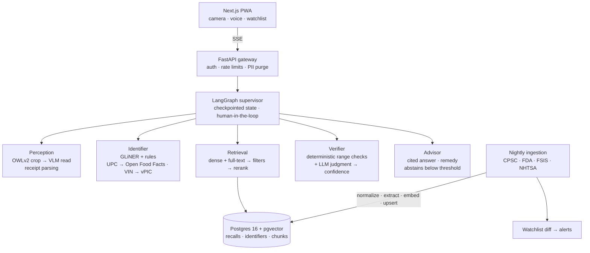

# RecallLens

[](https://github.com/coder-raj369/recall-lens/actions/workflows/ci.yml)

**Point a camera at a product, car, food or medicine and find out whether it has been recalled, with evidence.**

RecallLens is a multimodal, multi-agent system that identifies a product from a photo (or a receipt, or a voice query), extracts the identifiers that actually determine recall status (UPC, model number, lot code, best-by date, VIN), searches recalls from every major US recall authority, verifies whether *this specific unit* falls inside the recalled range, and explains the hazard and remedy with citations. When it cannot be sure, it says so.

> **Status:** Phases 0–3 complete (foundations; ingestion and corpus; retrieval; perception). Phase 4 (multi-agent orchestration) next. See [ROADMAP.md](ROADMAP.md) for the phased delivery plan.

---

## The problem

US recall data is fragmented across four agencies, each with its own API, schema and vocabulary:

| Agency | Covers | Source |
|---|---|---|
| CPSC | Consumer products (toys, appliances, furniture) | [SaferProducts.gov Recalls API](https://www.saferproducts.gov/) |
| FDA | Food, drugs, medical devices | [openFDA enforcement reports](https://open.fda.gov/apis/) |
| USDA FSIS | Meat, poultry, egg products | [FSIS Recall API](https://www.fsis.usda.gov/): *deferred, API blocks automated clients ([ADR-0004](docs/adr/0004-defer-fsis-ingestion.md))* |
| NHTSA | Vehicles, tires, car seats | [NHTSA Recalls API and datasets](https://www.nhtsa.gov/nhtsa-datasets-and-apis) |

Whether a recall applies to you usually depends on a detail printed on the product, such as a lot code, a production date window or a model suffix, not on the product name. Keyword search and plain semantic search both fail here: *"is lot 2231 inside 2201–2245?"* is a structured question, not a similarity question.

RecallLens treats it as one. Perception reads the label, extraction turns it into typed identifiers, retrieval finds candidate recalls, and a verifier applies deterministic range checks before any language model is asked for judgment.

## How it works



1. **Perceive.** A zero-shot detector locates the label, barcode and lot-code regions; crops are passed to a vision-language model, which is far more reliable on small print than a full-frame read.
2. **Identify.** A zero-shot NER model and rule-based parsers produce typed identifiers. Barcodes resolve through Open Food Facts; VINs decode through NHTSA vPIC.
3. **Retrieve.** Exact identifier matches short-circuit search. Otherwise, hybrid retrieval (vector + Postgres full-text, fused and filtered by agency, category and date) feeds a cross-encoder reranker.
4. **Verify.** Lot, date and model ranges are checked in code. The LLM only arbitrates what rules cannot decide, and it returns a calibrated confidence.
5. **Advise.** Answers must cite the recall notice. Below the confidence threshold, the system abstains and asks for a better photo instead of guessing.

## Design principles

- **A false "safe" is the worst possible answer.** The primary evaluation metric is the false-negative rate, and abstention is a first-class outcome.
- **Rules before models.** Anything that can be checked deterministically is checked deterministically.
- **Every claim is measured.** Each phase ships with a gold dataset, metrics and ablations; the results table below is filled in only with measured numbers.
- **One data store until proven otherwise.** Postgres holds relational data, full-text indexes and vectors ([ADR-0001](docs/adr/0001-postgres-pgvector.md)).

## Hugging Face tasks

| Task | Model | Role | Status |
|---|---|---|---|
| Zero-Shot Object Detection | OWLv2 | Locate label, barcode and rating-plate regions | In use (Phase 3) |
| Image-to-Text | Florence-2-large | Read label text (OCR) from photos and regions | In use (Phase 3) |
| Token Classification | GLiNER | Extract brands from recall and label text | In use (Phases 1, 3) |
| Sentence Similarity / Feature Extraction | bge-m3 | Dense embeddings | In use (Phase 1) |
| Text Ranking | bge-reranker-v2-m3 | Cross-encoder reranking (opt-in) | In use (Phase 2) |
| Text Generation | Claude Sonnet 5 / Haiku 4.5 | Verification, advice, routing | Phase 4 |
| Document Question Answering | Florence-2 / Donut | Parse receipts into line items | Phase 6 |
| Image Feature Extraction | SigLIP | Visual search for photos with no legible text | Planned |
| Automatic Speech Recognition *(stretch)* | whisper-large-v3-turbo | Voice queries | Stretch |

## Tech stack

| Layer | Choice |
|---|---|
| Language and tooling | Python 3.12, uv, Ruff, pytest |
| Orchestration | LangGraph ([ADR-0002](docs/adr/0002-langgraph-orchestration.md)) |
| Data | PostgreSQL 16 + pgvector, Redis (semantic cache) |
| Ingestion | Scheduled GitHub Actions workflow ([ADR-0005](docs/adr/0005-scheduled-ingestion-github-actions.md)) |
| Serving | FastAPI (SSE); local open models on CPU/Apple GPU ([ADR-0006](docs/adr/0006-local-open-vision-models.md)); GPU serving revisited in Phase 5 |
| Frontend | Next.js PWA |
| Evaluation | Custom harness, Ragas metrics, calibrated LLM-as-judge |
| Observability | Langfuse, OpenTelemetry |
| Delivery | GitHub Actions (tests and eval gate), Docker, Fly.io |

## Evaluation

Evaluation is built alongside each capability, not after it.

| Stage | Dataset | Metrics |
|---|---|---|
| Identifier extraction | 160 hand-labeled recalls (100 dev, 60 held-out test) | Field-level precision, recall, F1 |
| Retrieval | 150 known-item queries (50 dev, 100 held-out test) | Recall@k, MRR; ablation from dense to hybrid + identifiers + rerank |
| Perception | 150 labeled public photos (50 dev, 100 held-out test) | Field P/R/F1; whole photo vs + regions; photo-to-recall Recall@k |
| End to end | 300 cases incl. hard negatives (same product, different lot) | **False-negative rate**, precision, abstention rate, faithfulness |
| Operations | Load tests | p50/p95 latency, cost per query, cache hit rate |

The LLM judge is calibrated against human labels (Cohen's κ reported), and CI blocks any pull request that regresses the false-negative rate.

### Results

Populated as phases complete. No numbers are reported before they are measured.

#### Phase 1: corpus and identifier extraction

**Corpus.** A backfill of everything published from 2024-01-01 to 2026-09-25, run on an Apple-silicon laptop:

| Agency | Recalls | Breakdown | Sync time* |
|---|---|---|---|
| CPSC | 1,184 | consumer products | 10.4 min |
| FDA | 14,420 | 8,410 devices · 3,985 food · 2,025 drugs | 90.6 min |
| NHTSA | 2,724 | 2,425 vehicles · 246 equipment · 37 tires · 16 child seats | 6.9 min |
| **Total** | **18,328** | 26,537 embedded chunks (1.45 per recall) | ~1.5 h embedding |

\*Fetch, extraction (including GLiNER) and upsert. An immediate re-run of a 4,785-recall sync reported every recall unchanged, and the nightly workflow verifies all three connectors against the live APIs. USDA FSIS is deferred ([ADR-0004](docs/adr/0004-defer-fsis-ingestion.md)).

**Identifier extraction**, held-out test split (60 recalls, 289 gold identifiers). Codes must match exactly, and brands match leniently ([guidelines](evals/datasets/README.md)):

| Kind | Rules only | GLiNER only | Rules + GLiNER (all kinds) | **Production**: rules for codes, GLiNER for brands |
|---|---|---|---|---|
| Brand | — | 0.74 / 0.81 / 0.78 | 0.74 / 0.81 / 0.78 | **0.74 / 0.81 / 0.77** |
| Model | 0.91 / 0.28 / 0.43 | 0.46 / 0.37 / 0.41 | 0.50 / 0.46 / 0.48 | **0.91 / 0.28 / 0.43** |
| Lot / serial | 0.92 / 0.75 / 0.82 | 0.57 / 0.16 / 0.25 | 0.81 / 0.79 / 0.80 | **0.92 / 0.75 / 0.82** |
| UPC / GTIN | 1.00 / 0.50 / 0.67 | 0.64 / 0.35 / 0.45 | 0.74 / 0.54 / 0.62 | **1.00 / 0.50 / 0.67** |
| NDC | 1.00 / 1.00 / 1.00 | — | 1.00 / 1.00 / 1.00 | **1.00 / 1.00 / 1.00** |
| **All (micro)** | 0.93 / 0.41 / 0.57 | 0.62 / 0.40 / 0.49 | 0.72 / 0.70 / 0.71 | **0.85 / 0.63 / 0.73** |

Values are precision / recall / F1. The production configuration was chosen on the dev split, where letting GLiNER add codes lowered code F1 from 0.59 to 0.55. Keeping codes rule-based holds their precision at 0.93 by design: a wrong lot or model number is worse than a missing one, because the verifier can ask for a clearer photo when a code is missing but cannot detect a confidently wrong one. The main gaps are unlabeled model names and bare UPC digits, which Phase 3's label reading targets.

#### Phase 2: retrieval

Held-out test split: 100 known-item queries over the 18,328-recall corpus ([how the set was built](evals/datasets/README.md#retrieval)). Each row adds one stage. Recall@k is the share of queries with the target recall in the top k; latency is per query on an 8 GB Apple-silicon laptop, excluding query embedding.

| Configuration | Strict R@1 | Strict R@5 | Strict MRR@10 | Lenient R@5 | p50 | p95 |
|---|---|---|---|---|---|---|
| Dense (bge-m3, HNSW) | 0.63 | 0.82 | 0.72 | 0.87 | 94 ms | 323 ms |
| Full-text, IDF-weighted | 0.83 | 0.97 | 0.88 | 0.99 | 4 ms | 11 ms |
| Hybrid (RRF of both) | 0.70 | 0.92 | 0.80 | 0.97 | 29 ms | 72 ms |
| **+ exact identifier matches** (default) | **0.78** | **0.94** | **0.85** | **0.98** | **33 ms** | **73 ms** |
| + bge-reranker-v2-m3 (`--rerank`) | 0.85 | 0.99 | 0.90 | 1.00 | 4.8 s | 23.8 s |

| Strict R@5 by query type | Brand (23) | Code (21) | Descriptive (26) | Equipment (7) | Vehicle (23) |
|---|---|---|---|---|---|
| Dense | 0.91 | 0.62 | 0.77 | 0.71 | 1.00 |
| Full-text, IDF-weighted | 0.96 | 1.00 | 0.92 | 1.00 | 1.00 |
| Hybrid + identifiers | 0.96 | 1.00 | 0.81 | 1.00 | 1.00 |
| + reranker | 0.96 | 1.00 | 1.00 | 1.00 | 1.00 |

What the ablation showed, and what changed because of it:

- **Postgres full-text ranking needed IDF.** With `ts_rank_cd`, full-text search reached 0.52 R@5 on the dev split and dragged hybrid fusion below dense search alone, because words in nearly every recall ("recall", "lot", "hazard") outranked brand names. Ranking by summed inverse document frequency from a materialized `lexeme_stats` view lifted it to 0.96 on dev and 0.97 on test.
- **Dense search misses codes** (0.62 R@5 on code queries). Exact identifier lookup fixes that inside the hybrid pipeline (1.00).
- **The reranker is opt-in, decided on dev.** On the dev split it added 0.02 MRR for about 5 s per query on this CPU-only laptop, so it was not enabled by default. The held-out split shows a larger gain concentrated on descriptive queries (0.81 → 1.00 R@5). The default was deliberately not changed after seeing test results; enabling it belongs with GPU serving and a latency budget in Phase 5.
- **Known bias: full-text alone looks best.** Queries were written while reading their target recall, so they share its rare words, and equal-weight fusion lets dense search dilute that signal. Photo-derived queries in Phase 3 will test paraphrase robustness without that bias before fusion weights are tuned.
- **HNSW needed no tuning yet.** pgvector's HNSW returned only `ef_search` (40) rows, silently truncating candidates, until `ef_search` was raised per query. With that fix it keeps 97.3% of the exact top-50 neighbors at 27 ms p50 against 69 ms for an exact scan. Filtered searches scan exactly, since pgvector 0.6 filters after the index scan.

#### Phase 3: perception

Held-out test split: 100 public photos (73 CPSC recall-notice photos, 27 Open Food Facts product photos) labeled with the identifiers legible in each ([how the set was built](evals/datasets/README.md#photos)). The pipeline reads the whole photo with Florence-2 OCR and, when enabled, each label region OWLv2 detects; it decodes barcodes (also on 2x/4x enlargements of regions), finds VINs, and feeds the text through the Phase 1 extractors. Latency is per photo on an 8 GB Apple-silicon laptop.

| Field (P / R / F1) | Whole photo | **+ detected regions** (default) |
|---|---|---|
| Brand | 0.42 / 0.48 / 0.45 | 0.39 / 0.52 / 0.44 |
| Model | 0.55 / 0.33 / 0.41 | 0.48 / 0.36 / 0.41 |
| Lot / serial | 0.40 / 0.15 / 0.22 | 0.37 / 0.17 / 0.24 |
| UPC (5 photos) | 1.00 / 0.80 / 0.89 | 0.71 / 1.00 / 0.83 |
| Any code, kind-agnostic | 0.24 / 0.58 / 0.34 | 0.24 / **0.75** / 0.36 |
| Latency p50 / p95 | 2.9 s / 12.6 s | 5.7 s / 23.0 s |

| Photo to recall | Strict R@1 | Strict R@5 | MRR@10 | Photos with legible text (73) | Product-only photos (27) |
|---|---|---|---|---|---|
| Whole photo, full-OCR query | 0.37 | 0.60 | 0.46 | 0.77 | 0.15 |
| + regions, full-OCR query | 0.42 | 0.62 | 0.51 | 0.79 | 0.15 |
| **+ regions, focused query** (default) | 0.37 | 0.61 | 0.47 | 0.78 | 0.15 |

What the evaluation showed, and what changed because of it:

- **Region reading is for codes, not for finding the recall.** Reading detected regions raises kind-agnostic code recall from 0.58 to 0.75 and reaches every labeled UPC, while photo-to-recall R@5 moves only from 0.60 to 0.62. It is on by default because Phase 4 needs lot and serial codes to decide whether a specific unit is affected, and it doubles latency.
- **Photos with nothing to read are the ceiling.** With legible text, the right recall is in the top 5 for 78% of photos; product-only photos reach 15%. Text search cannot find them; visual similarity against recall-notice images is the fix, and it cannot be measured fairly on this set because its CPSC photos are the notice images themselves.
- **Small print stays hard.** Lot and serial recall is 0.17: CPSC notice photos are often under 500 px, Florence-2 reads at 768 x 768, and misreads such as "4315KB" for "43115BK" defeat exact matching.
- **Dev error analysis fixed two gaps.** Recall text listing affected units by "date codes", or with linking words ("model numbers are 17249 and 17310"), produced no identifiers, so the extraction rules were extended (Phase 1 extraction results were unchanged). OCR splitting barcode digits ("6 194389 198176") was repaired, lifting dev code recall from 0.66 to 0.69.
- **Query strategy is a near-tie.** On dev, focused queries (lookups, brands, codes and whole-photo text) tied full-OCR queries, so the shorter one became the default; an identifier-only query was worse (0.56 against 0.64 R@5) and was dropped. On the held-out split full-OCR queries rank slightly higher (R@1 0.42 against 0.37, five photos); the default was not changed after seeing test results. Long OCR text matches boilerplate in long FDA reports, which points to BM25-style length normalization in full-text ranking as the next retrieval improvement.

#### Later phases

| Metric | Baseline | Current |
|---|---|---|
| End-to-end false-negative rate | — | — |
| p95 latency | — | — |
| Cost per query | — | — |

## Getting started

**Prerequisites:** Python 3.12, [uv](https://docs.astral.sh/uv/), Docker.

```bash
git clone https://github.com/coder-raj369/recall-lens.git
cd recall-lens
cp .env.example .env
docker compose up -d                          # Postgres 16 + pgvector
uv sync                                       # install dependencies from uv.lock
export $(grep -v '^#' .env | xargs)
uv run python -m recall_lens.db.migrate       # apply schema migrations
uv run pytest                                 # database tests run when DATABASE_URL is set
uv run ruff check . && uv run ruff format --check .
```

Ingest recalls and evaluate extraction:

```bash
uv sync --group ml                                        # GLiNER and bge-m3 (optional, ~3 GB of weights)
uv run python -m recall_lens.ingest --since 2026-01-01    # sync all agencies, then embed
uv run python -m recall_lens.ingest --no-model --no-embed # rules only, no ML dependencies
uv run python -m recall_lens.evals.extraction --split test
```

Search and evaluate retrieval:

```bash
uv run python -m recall_lens.retrieval "is my vornado space heater recalled for fire"
uv run python -m recall_lens.retrieval "rear camera blank image" --agency nhtsa --since 2025-01-01
uv run python -m recall_lens.retrieval "baby lounger suffocation" --rerank   # cross-encoder, slower
uv run python -m recall_lens.evals.retrieval --split test --hnsw-check
```

Find recalls from a product photo and evaluate perception (weights: Florence-2-large 1.6 GB, OWLv2 0.6 GB):

```bash
uv run python -m recall_lens.perception path/or/url/to/photo.jpg
uv run python -m recall_lens.perception photo.jpg --no-detection   # whole photo only, about 2x faster
uv run python -m recall_lens.evals.photos --split test              # downloads the photos once
```

Without `--since`, ingestion is incremental: each agency restarts from its last successful run minus a 30-day overlap.

## Repository layout

```
recall-lens/
├── docs/adr/              Architecture decision records
├── evals/datasets/        Labeled evaluation sets and labeling guidelines
├── src/recall_lens/
│   ├── db/                Schema migrations and runner
│   ├── ingest/            Agency connectors, idempotent store, embedding, sync CLI
│   ├── extract/           Rule-based and GLiNER identifier extraction
│   ├── retrieval/         Dense, IDF full-text and identifier search, fusion, reranking
│   ├── perception/        Photo loading, OWLv2 regions, Florence-2 OCR, barcodes, VINs, photo search
│   └── evals/             Evaluation harnesses
├── tests/                 Test suite (real recall records as fixtures)
└── .github/workflows/     CI and nightly ingestion
```

Modules for agents, the API and the web client are added in the phase that introduces them; see [ROADMAP.md](ROADMAP.md).

## Disclaimer

RecallLens is an engineering project, not an official source of recall information. Always confirm recall status with the issuing agency or manufacturer.
