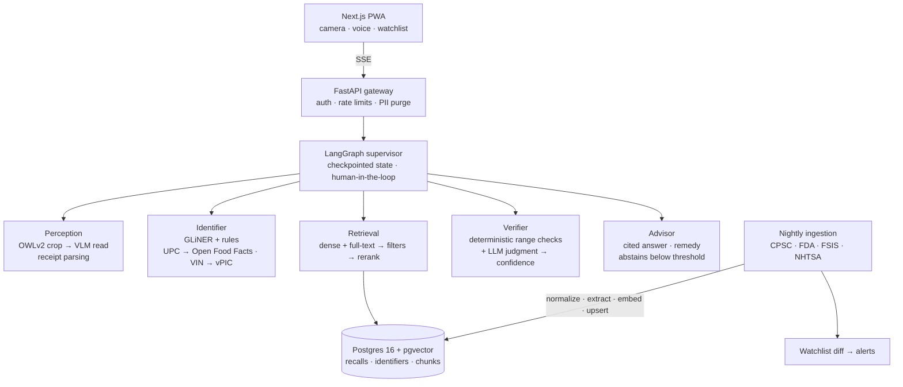

# RecallLens

[](https://github.com/coder-raj369/recall-lens/actions/workflows/ci.yml)

**Point a camera at a product, car, food or medicine and find out whether it has been recalled, with evidence.**

RecallLens is a multimodal, multi-agent system that identifies a product from a photo (or a receipt, or a voice query), extracts the identifiers that actually determine recall status (UPC, model number, lot code, best-by date, VIN), searches recalls from every major US recall authority, verifies whether *this specific unit* falls inside the recalled range, and explains the hazard and remedy with citations. When it cannot be sure, it says so.

> **Status:** Phase 0 (foundations) complete; Phase 1 (ingestion) next. See [ROADMAP.md](ROADMAP.md) for the phased delivery plan.

---

## The problem

US recall data is fragmented across four agencies, each with its own API, schema and vocabulary:

| Agency | Covers | Source |
|---|---|---|
| CPSC | Consumer products (toys, appliances, furniture) | [SaferProducts.gov Recalls API](https://www.saferproducts.gov/) |
| FDA | Food, drugs, medical devices | [openFDA enforcement reports](https://open.fda.gov/apis/) |
| USDA FSIS | Meat, poultry, egg products | [FSIS Recall API](https://www.fsis.usda.gov/): *deferred, API blocks automated clients ([ADR-0004](docs/adr/0004-defer-fsis-ingestion.md))* |
| NHTSA | Vehicles, tires, car seats | [NHTSA Recalls API and datasets](https://www.nhtsa.gov/nhtsa-datasets-and-apis) |

Whether a recall applies to you usually depends on a detail printed on the product, such as a lot code, a production date window or a model suffix, not on the product name. Keyword search and plain semantic search both fail here: *"is lot 2231 inside 2201–2245?"* is a structured question, not a similarity question.

RecallLens treats it as one. Perception reads the label, extraction turns it into typed identifiers, retrieval finds candidate recalls, and a verifier applies deterministic range checks before any language model is asked for judgment.

## How it works



1. **Perceive.** A zero-shot detector locates the label, barcode and lot-code regions; crops are passed to a vision-language model, which is far more reliable on small print than a full-frame read.
2. **Identify.** A zero-shot NER model and rule-based parsers produce typed identifiers. Barcodes resolve through Open Food Facts; VINs decode through NHTSA vPIC.
3. **Retrieve.** Exact identifier matches short-circuit search. Otherwise, hybrid retrieval (vector + Postgres full-text, fused and filtered by agency, category and date) feeds a cross-encoder reranker.
4. **Verify.** Lot, date and model ranges are checked in code. The LLM only arbitrates what rules cannot decide, and it returns a calibrated confidence.
5. **Advise.** Answers must cite the recall notice. Below the confidence threshold, the system abstains and asks for a better photo instead of guessing.

## Design principles

- **A false "safe" is the worst possible answer.** The primary evaluation metric is the false-negative rate, and abstention is a first-class outcome.
- **Rules before models.** Anything that can be checked deterministically is checked deterministically.
- **Every claim is measured.** Each phase ships with a gold dataset, metrics and ablations; the results table below is filled in only with measured numbers.
- **One data store until proven otherwise.** Postgres holds relational data, full-text indexes and vectors ([ADR-0001](docs/adr/0001-postgres-pgvector.md)).

## Hugging Face tasks

| Task | Model | Role |
|---|---|---|
| Zero-Shot Object Detection | OWLv2 | Locate label, barcode and lot-code regions |
| Image-Text-to-Text | Open VLM (Qwen-VL family) | Read labels into structured fields |
| Document Question Answering | VLM / Donut | Parse receipts into line items |
| Visual Document Retrieval | ColQwen | Retrieve image-only recall notices |
| Token Classification | GLiNER | Extract model, lot, UPC and date ranges from text |
| Sentence Similarity / Feature Extraction | bge-m3 | Dense embeddings |
| Text Ranking | bge-reranker-v2-m3 | Cross-encoder reranking |
| Zero-Shot Classification | LLM / NLI | Route queries by agency and hazard category |
| Automatic Speech Recognition *(stretch)* | whisper-large-v3-turbo | Voice queries |
| Text Generation | Claude Sonnet 5 / Haiku 4.5 | Verification, advice, routing |

## Tech stack

| Layer | Choice |
|---|---|
| Language and tooling | Python 3.12, uv, Ruff, pytest |
| Orchestration | LangGraph ([ADR-0002](docs/adr/0002-langgraph-orchestration.md)) |
| Data | PostgreSQL 16 + pgvector, Redis (semantic cache) |
| Ingestion | Prefect |
| Serving | FastAPI (SSE); vLLM on Modal for GPU models |
| Frontend | Next.js PWA |
| Evaluation | Custom harness, Ragas metrics, calibrated LLM-as-judge |
| Observability | Langfuse, OpenTelemetry |
| Delivery | GitHub Actions (tests and eval gate), Docker, Fly.io |

## Evaluation

Evaluation is built alongside each capability, not after it.

| Stage | Dataset | Metrics |
|---|---|---|
| Identifier extraction | 100 hand-labeled recalls | Field-level precision, recall, F1 |
| Retrieval | 150 text queries → recall IDs | Recall@k, MRR; dense vs hybrid vs hybrid + rerank |
| Perception | 100+ labeled product photos | Field accuracy; crop vs no-crop |
| End to end | 300 cases incl. hard negatives (same product, different lot) | **False-negative rate**, precision, abstention rate, faithfulness |
| Operations | Load tests | p50/p95 latency, cost per query, cache hit rate |

The LLM judge is calibrated against human labels (Cohen's κ reported), and CI blocks any pull request that regresses the false-negative rate.

### Results

Populated as phases complete. No numbers are reported before they are measured.

| Metric | Baseline | Current |
|---|---|---|
| Retrieval Recall@5 | — | — |
| End-to-end false-negative rate | — | — |
| p95 latency | — | — |
| Cost per query | — | — |

## Getting started

**Prerequisites:** Python 3.12, [uv](https://docs.astral.sh/uv/), Docker.

```bash
git clone https://github.com/coder-raj369/recall-lens.git
cd recall-lens
cp .env.example .env
docker compose up -d                          # Postgres 16 + pgvector
uv sync                                       # install dependencies from uv.lock
export $(grep -v '^#' .env | xargs)
uv run python -m recall_lens.db.migrate       # apply schema migrations
uv run pytest                                 # database tests run when DATABASE_URL is set
uv run ruff check . && uv run ruff format --check .
```

## Repository layout

```
recall-lens/
├── docs/adr/            Architecture decision records
├── src/recall_lens/     Application package
│   └── db/              Schema migrations and runner
├── tests/               Test suite
└── .github/workflows/   Continuous integration
```

Modules for ingestion, extraction, retrieval, perception, agents, API, evaluation and the web client are added in the phase that introduces them; see [ROADMAP.md](ROADMAP.md).

## Disclaimer

RecallLens is an engineering project, not an official source of recall information. Always confirm recall status with the issuing agency or manufacturer.
